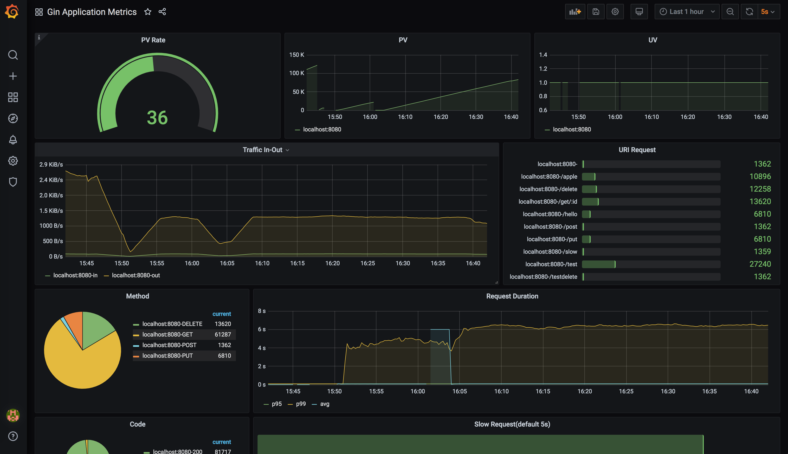

# gin-metrics
gin-gonic/gin metrics exporter for Prometheus.

[中文](README_zh.md)

- [Introduction](#Introduction)
- [Grafana](#Grafana)
- [Installation](#Installation)
- [Usage](#Usage)
- [Custom Metric](#Custom-Metric)
- [Metric with separate port](#Metric-with-separate-port)
- [Contributing](#Contributing)

## Introduction

`gin-metrics` defines some metrics for gin http-server. There have easy way to use it.

Below is the detailed description for every metric.

| Metric                  | Type      | Description                                         |
| ----------------------- | --------- | --------------------------------------------------- |
| gin_request_total       | Counter   | all the server received request num.                |
| gin_request_uv          | Counter   | all the server received ip num.                     |
| gin_uri_request_total   | Counter   | all the server received request num with every uri. |
| gin_request_body_total  | Counter   | the server received request body size, unit byte.   |
| gin_response_body_total | Counter   | the server send response body size, unit byte.      |
| gin_request_duration    | Histogram | the time server took to handle the request.         |
| gin_slow_request_total  | Counter   | the server handled slow requests counter, t=%d.     |


## Grafana


Set the `grafana` directory for details.




## Installation

```bash
$ go get github.com/penglongli/gin-metrics
```

## Usage

Your can see some metrics across `http://localhost:8080/metrics`

```go
package main

import (
	"github.com/gin-gonic/gin"

	"github.com/penglongli/gin-metrics/ginmetrics"
)

func main() {
	r := gin.Default()

	// get global Monitor object
	m := ginmetrics.GetMonitor()

	// +optional set metric path, default /debug/metrics
	m.SetMetricPath("/metrics")
	// +optional set slow time, default 5s
	m.SetSlowTime(10)
	// +optional set request duration, default {0.1, 0.3, 1.2, 5, 10}
	// used to p95, p99
	m.SetDuration([]float64{0.1, 0.3, 1.2, 5, 10})

	// set middleware for gin
	m.Use(r)

	r.GET("/product/:id", func(ctx *gin.Context) {
		ctx.JSON(200, map[string]string{
			"productId": ctx.Param("id"),
		})
	})

	_ = r.Run()
}
```

## Custom Metric

`gin-metric` provides ways to custom your own metric.

### Gauge

With `Gauge` type metric, you can use three functions to change it's value.

And you should define a `Gauge` Metric first, 

```go
gaugeMetric := &ginmetrics.Metric{
    Type:        ginmetrics.Gauge,
    Name:        "example_gauge_metric",
    Description: "an example of gauge type metric",
    Labels:      []string{"label1"},
}

// Add metric to global monitor object
_ = ginmetrics.GetMonitor().AddMetric(gaugeMetric)
```

**SetGaugeValue** 

`SetGaugeValue` will setting metric value directly。

```go
_ = ginmetrics.GetMonitor().GetMetric("example_gauge_metric").SetGaugeValue([]string{"label_value1"}, 0.1)
```

**Inc**

`Inc` will increase 1 to metric value

```go
_ = ginmetrics.GetMonitor().GetMetric("example_gauge_metric").Inc([]string{"label_value1"})
```

**Add**

`Add` will add float64 num to metric value

```go
_ = ginmetrics.GetMonitor().GetMetric("example_gauge_metric").Add([]string{"label_value1"}, 0.2)
```

### Counter

With `Counter` type metric, you can use `Inc` and `Add` function, don't use `SetGaugeValue`.


### Histogram and Summary

For `Histogram` and `Summary` type metric, should use `Observe` function.

## Metric with separate port

For some users, they don't want to merge the port of the metric with the port of the application.

So we provide a way to separate the metric port. Here is the example.

```go
func main() {
	appRouter := gin.Default()
	metricRouter := gin.Default()

	m := ginmetrics.GetMonitor()
	// use metric middleware without expose metric path
	m.UseWithoutExposingEndpoint(appRouter)
	// set metric path expose to metric router
	m.Expose(metricRouter)

	appRouter.GET("/product/:id", func(ctx *gin.Context) {
		ctx.JSON(200, map[string]string{
			"productId": ctx.Param("id"),
		})
	})
	go func() {
		_ = metricRouter.Run(":8081")
	}()
	_ = appRouter.Run(":8080")
}
```

## Contributing

If someone has a problem or suggestions, you can submit [new issues](https://github.com/penglongli/gin-metrics/issues/new) 
or [new pull requests](https://github.com/penglongli/gin-metrics/pulls). 

